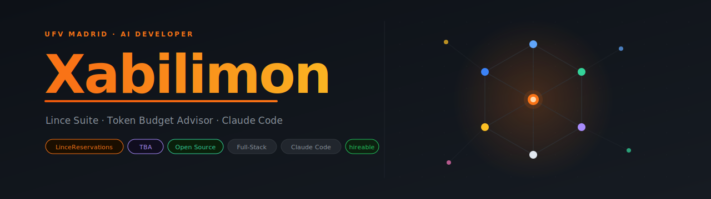

  

---

I'm **Xabi**, an AI student at [Universidad Francisco de Vitoria](https://www.ufv.es) (Madrid). I build production software at the intersection of AI and practical engineering — institutional tools, developer utilities, and Claude Code skills.

---

### Stack

---

### Projects

<table>
<tr>
<td width="50%" valign="top">

#### [LinceReservations](https://github.com/Xabilimon1/LinceReservations)

Full-stack room booking system deployed at [UFV](https://www.ufv.es)'s DOT space. 12 rooms, 4 user roles (student, professor, PAS, admin), real-time sync via Supabase Realtime, Outlook Calendar integration via Microsoft Graph, institutional email via Office 365, admin dashboard with audit logs, blacklist system, XLSX report exports, and 5-language i18n.

`React 19` `TypeScript` `Supabase` `Azure AD` `Vercel` `Tailwind CSS`

[🌐 reservas-salas-dot.vercel.app](https://reservas-salas-dot.vercel.app)

</td>
<td width="50%" valign="top">

#### [Token Budget Advisor](https://github.com/Xabilimon1/TBA-Token-Budget-Advisor-Claude-Code)

Claude Code skill that intercepts your prompt, estimates token consumption with a zero-dependency heuristic engine (~85–90% accuracy), and lets you choose how deep Claude's answer should be before it responds.

Contributed to [**everything-claude-code**](https://github.com/affaan-m/everything-claude-code) by affaan-m — the agent harness with 149k+ stars used across the Claude Code ecosystem.

`Python 3.8+` `Claude Code` `zero dependencies`

</td>
</tr>
<tr>
<td width="50%" valign="top">

#### [save-session](https://github.com/Xabilimon1/save-session)

Claude Code skill that saves compressed session summaries to an Obsidian vault, automatically maintaining bidirectional links between project notes, session logs, and technology nodes.

`Claude Code skill` `Obsidian` `Markdown`

</td>
<td width="50%" valign="top">

#### Lince Suite

Portfolio of internal web tools for UFV's DOT space — operational management interfaces built as lightweight applications deployed on Vercel.

`HTML` `CSS` `JavaScript` `Vercel`

</td>
</tr>
</table>

---

### Stats

---

  

